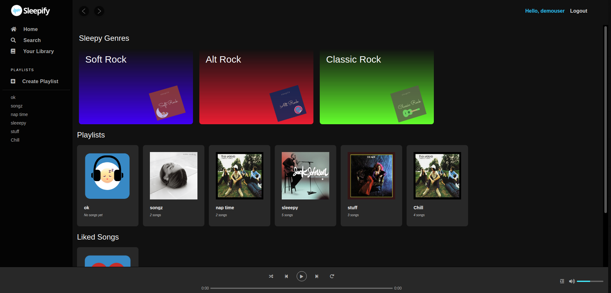
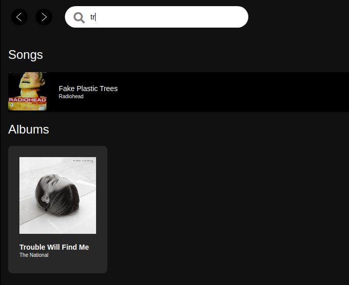
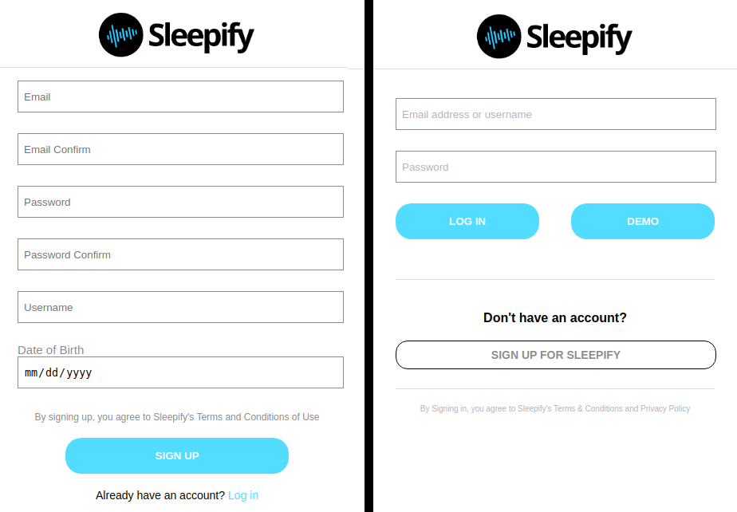
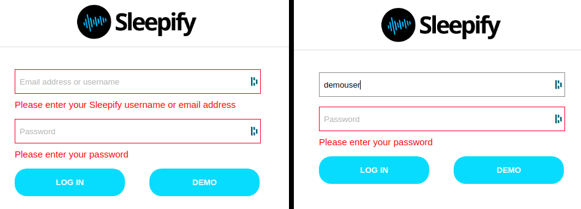

# sleepify

## Background and Overview
Sleepify is a MERN stack application that mimics the style and functionality of the popular music streaming app Spotify. Visitors to the application are able to play music, create playlists, and like their favorite songs with the creation of an account. Users are also able to search for their favorite songs, artists, and albums.



## Latest Version
To see the most up to date version, please visit the [web application](https://sleepify-dev.herokuapp.com/).

## Technologies and Technical Challenges
- Constructing HTML5 audio player
- Routes using Express
- Storing audio in AWS S3
- Search feature
- Hosting on Heroku

## Feature Spotlight
### Media Player
The implementation of the media player is illustrated below.


### Search

A demonstration of the search functionality can be seen in the example below.



### Playlist CRUD (Create, Read, Update, Delete)

An example of a playlist page can be seen below.


The modal used to create a new playlist can be seen below.


### User Authentication
A custom user authentication pattern was used in this application. A preview of the login and signup pages can be seen below.




## Challenges ##
> Authentication Errors

One of the challenges we faced while building the custom authentication pattern for this application, was getting the auth errors to disappear and the input boxes to stop flashing red after the user has begun typing something in the incorrect field. The implementation of this can be seen below.



## Solutions ##
> Authentication Errors

This functionality was achieved using class manipulation and CSS. The errors would be displayed if the input class did not contain 'hidden' and the input box would be red if the class included 'has-error'. 

```javascript
  changeBorder(values = "all") {
    if(values === "all") {
      //change border of both input values
      let element = document.getElementById('email');
      let error = document.getElementById('email-error')
      if(element) {
        if (!error.classList.contains("hidden") && (!this.state.errors.login)){
          element.classList.add("has-error")
        }
      }
      //change border of password input box
      element = document.getElementById('password');
      error = document.getElementById('password-error')
      if (element) {
        if (!error.classList.contains("hidden") && (!this.state.errors.login)){
          element.classList.add("has-error")
        }
      }
    } else {
      //change border of email input box
      let element = document.getElementById(values);
      const errorId = values + "-error"
      let error = document.getElementById(errorId)
      if(element && error) {
        element.classList.remove("has-error")
        error.classList.add("hidden")
      }
    }
  }
```

The function executed on the onBlur event handler can be seen below. If a value is present in the input, then the classes would be manipulated so the errors would dissappear. If a value is not present, the relevant classes would be added/removed so the errors would display.

```javascript
  //change border if something is in the input box
  changeBorderonBlur(value) {
    let element = document.getElementById(value);
    if(element && !this.state[value]) {
      const errorId = value + "-error"
      let error = document.getElementById(errorId)
      error.classList.remove("hidden")
      element.classList.add("has-error")
    } else if (element && this.state[value]){
      const errorId = value + "-error"
      let error = document.getElementById(errorId)
      error.classList.add("hidden")
      element.classList.remove("has-error")
    }
  }

```

## Future Updates
| Version Number        | Updates           | 
| :------------- |:------------- |
| Version 1.0      | Initial Release |  


<!-- 
Task:
  - user auth
  - db/Schema
    - user:
        - username
        - email
        - date_of_birth
        - password_digest
        - session_token
        * user has many playlist
    - playlist
        - title
        -user_id
        * belongs to user
        * has many songs
    - library
        has many artist
    - artist
        - name
        - image_url
        
        * has many songs
    - songs
        - id
        - title
        - artist_id
        - album_title
        - ID3?

    - seeding
  - user dashboard -->
