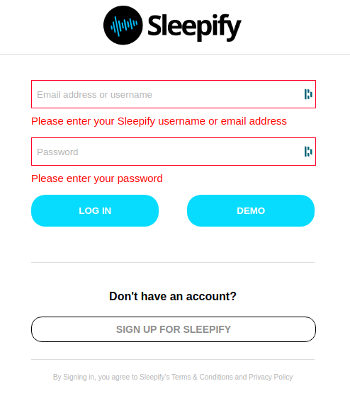
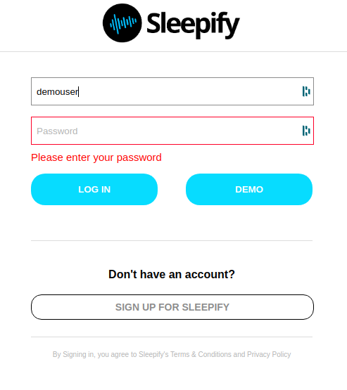

# sleepify

## Background and Overview
Sleepify is a MERN stack application that mimics the style and functionality of the popular music streaming app Spotify. Visitors to the application are able to play music, create playlists, and like their favorite songs with the creation of an account. Users are also able to search for their favorite songs, artists, and albums.

## Functionality and MVPs
- New account creation, login, and guest/demo login
- Playlist CRUD
- Media Player
  - Play, Stop, Pause, Next, Previous
  - Repeat, Shuffle
  - Dynamic volume slider
  - Move to different parts of the song
  - Continuous play while navigating site
- Search
- Following playlists/ Liking songs
- A production README (NB: check out the sample production README)
- Hosting on Heroku

- Bonus:
  - Popular Tracks
  - Recommendations
  - OAuth
  - Friending users
  - Explore Page
  - Radio (shuffle play)

## Technologies and Technical Challenges
- Constructing HTML5 audio player
- Routes using Express
- Storing audio in AWS S3
- Search feature
- Hosting on Heroku

## Group Members and Work Breakdown

  - Tristan
    - Database seeding
  - Kevin
    - Music Player 
  - Don
    - User Auth, Auth Errors
    - Song Likes
  - Sam
    - Splash Page

## Challenges ##
> Authentication Errors

One of the challenges we faced while building the custom authentication pattern for this application, was getting the auth errors to disappear and the input boxes to stop flashing red after the user has begun typing something in the incorrect field. The implementation of this can be seen below.

## Solutions ##
> Authentication Errors

Task:
  - user auth
  - db/Schema
    - user:
        - username
        - email
        - date_of_birth
        - password_digest
        - session_token
        * user has many playlist
    - playlist
        - title
        -user_id
        * belongs to user
        * has many songs
    - library
        has many artist
    - artist
        - name
        - image_url
        
        * has many songs
    - songs
        - id
        - title
        - artist_id
        - album_title
        - ID3?

    - seeding
  - user dashboard
